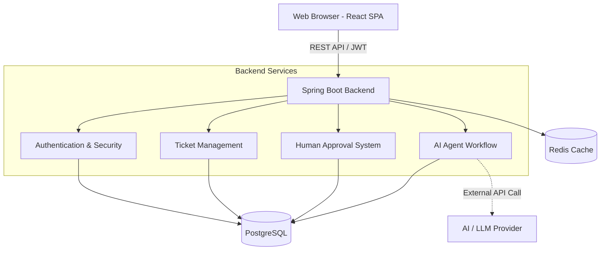
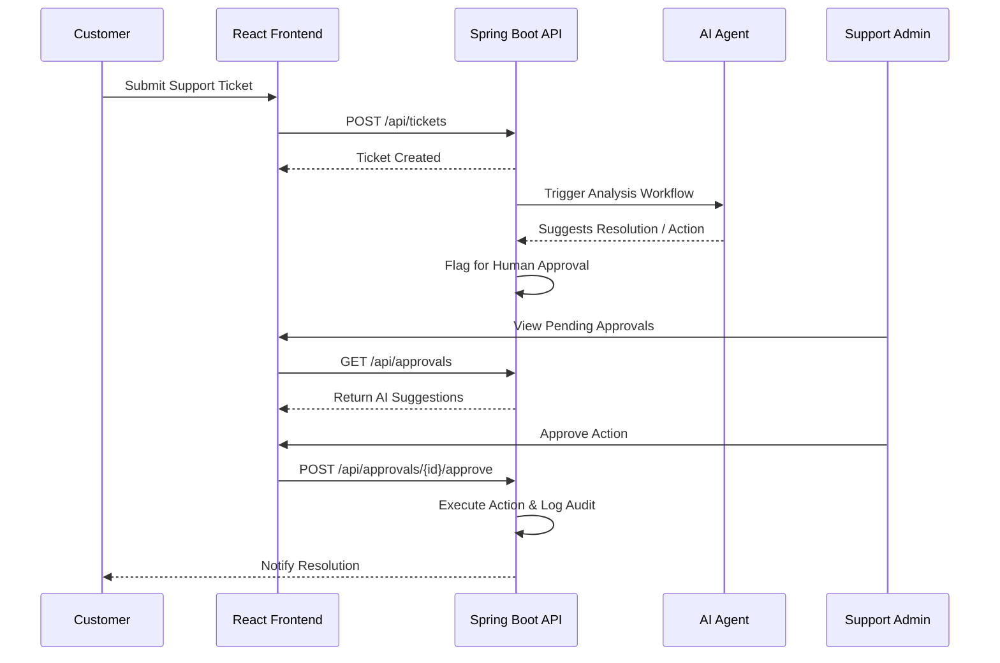

# AgenticFi - AI-Powered Customer Support & Workflow Automation

AgenticFi is a production-ready, full-stack SaaS platform designed to streamline customer support and operations. It intelligently blends AI agent automation with human-in-the-loop approval workflows, featuring advanced ticket management, knowledge bases, and comprehensive audit logs.

---

## 🛑 Problem Statement
Traditional customer support systems are often manual, slow, and disconnected, leading to high resolution times. On the other hand, automating these systems entirely with AI can lead to unverified or incorrect actions that damage customer trust. There is a critical need for a platform that leverages AI for efficiency while keeping human agents in control of critical decisions.

## 💡 Solution Overview
AgenticFi provides a unified workspace where:
1. Customers can seamlessly raise and track support tickets.
2. AI agents can analyze tickets, suggest resolutions, or automate standard workflows.
3. Human admins can review, approve, and audit AI actions before they are executed.
This hybrid approach ensures lightning-fast support without compromising quality or safety.

---

## ✨ Features
- **🤖 AI Agent Workflows:** Automated ticket analysis and routing.
- **🎫 Advanced Ticket Management:** Complete lifecycle management for customer issues.
- **👨‍💻 Human-in-the-Loop Approvals:** Secure gates for reviewing AI-suggested actions.
- **📊 Real-time Dashboards & Reports:** Interactive charts (via Recharts) for system and agent performance.
- **🔐 Secure Authentication:** JWT-based auth with Role-Based Access Control (RBAC).
- **📚 Knowledge Base Integration:** Centralized information for agents and AI.
- **🛡️ Audit Logs:** Immutable records of all actions for compliance and tracking.

---

## 🛠️ Tech Stack

### Frontend
- **Framework:** React 19, TypeScript, Vite
- **Styling:** Tailwind CSS, Framer Motion
- **Routing & Icons:** React Router v7, Lucide React
- **Data Visualization:** Recharts

### Backend
- **Core:** Java 21, Spring Boot 3.3
- **Security:** Spring Security (JWT)
- **Database:** PostgreSQL (via Spring Data JPA / Hibernate)
- **Caching:** Redis

### Infrastructure
- **Containerization:** Docker, Docker Compose
- **Build Tool:** Maven

---

## 🏛️ High-Level Architecture Diagram



---

## 🔄 Project Workflow Diagram



---

## 📂 Folder Structure

```text
samplee-main/
│
├── src/                         # FRONTEND CODEBASE
│   ├── assets/                  # Static assets
│   ├── components/              # Reusable React components (Layout, UI)
│   ├── lib/                     # Utility functions and helpers
│   ├── pages/                   # Page components (Dashboards, Auth)
│   ├── App.tsx                  # Main router configuration
│   └── main.tsx                 # React entry point
│
├── backend/                     # BACKEND CODEBASE
│   ├── src/main/java/           # Java source code
│   │   └── com/agenticfi/       # Base package (Config, Security, Domain)
│   ├── src/main/resources/      # Application properties (application.yml)
│   ├── docker-compose.yml       # Infra services (Postgres, Redis)
│   ├── Dockerfile               # Backend Docker configuration
│   └── pom.xml                  # Maven dependencies
│
├── package.json                 # Frontend NPM dependencies
└── vite.config.ts               # Vite bundler configuration
```

---

## ⚙️ Configuration (.env)

### Frontend Environment Variables (Create `.env` in root)
```env
VITE_API_BASE_URL=http://localhost:8080/api/v1
```

### Backend Environment Variables (For Prod Profile)
These can be passed when running the backend in production. For local dev, defaults are in `application.yml`.
```env
DB_HOST=localhost
DB_PORT=5432
DB_NAME=agenticfi
DB_USER=postgres
DB_PASS=postgres
REDIS_HOST=localhost
REDIS_PORT=6379
REDIS_PASS=your_redis_password
JWT_SECRET=your_super_secret_jwt_key_here
JWT_EXPIRATION_MS=86400000
```

---

## 🚀 Installation & How to Run

### Prerequisites
- Node.js (v18+)
- Java 21
- Maven
- Docker & Docker Compose

### 1. Start Infrastructure (Database & Cache)
Navigate to the backend directory and start the Docker containers:
```bash
cd backend
docker-compose up -d postgres redis
```

### 2. Run the Backend (Spring Boot)
Build and run the Spring Boot application (runs on port `8080`):
```bash
./mvnw clean install
./mvnw spring-boot:run
```

### 3. Run the Frontend (React + Vite)
Open a new terminal, navigate to the project root, install dependencies, and start the dev server:
```bash
npm install
npm run dev
```
The frontend will be available at `http://localhost:5173`.

---

## 🔌 API Endpoints

Once the backend server is running, the OpenAPI / Swagger UI documentation is automatically generated. You can explore and test all API endpoints directly via:

- **Swagger UI:** [http://localhost:8080/swagger-ui/index.html](http://localhost:8080/swagger-ui/index.html)
- **OpenAPI JSON:** [http://localhost:8080/v3/api-docs](http://localhost:8080/v3/api-docs)

---

## 🧩 Project Modules

- **Authentication & Security:** Login, Signup, Password Recovery, Profile Setup, and Security Center.
- **Customer Portal:** Interface for end-users to raise tickets and view responses.
- **Support Operations:** Ticket Management, Knowledge Base, and operational Reports.
- **Admin Command Center:** AI Workspace (managing AI agents), Human Approvals queue, Audit Logs, and global User Settings.

---

## 🔮 Future Scope
- **Multi-Tenant Architecture:** Enable SaaS capabilities for multiple organizations with isolated data.
- **Omnichannel Support:** Integration with Slack, Microsoft Teams, Email, and WhatsApp.
- **Advanced Predictive AI:** Pre-emptively solving user issues before tickets are even raised using advanced analytics.
- **Mobile Application:** A native React Native app for on-the-go admin approvals and support.

---

## 📄 License
This project is licensed under the [MIT License](LICENSE).
